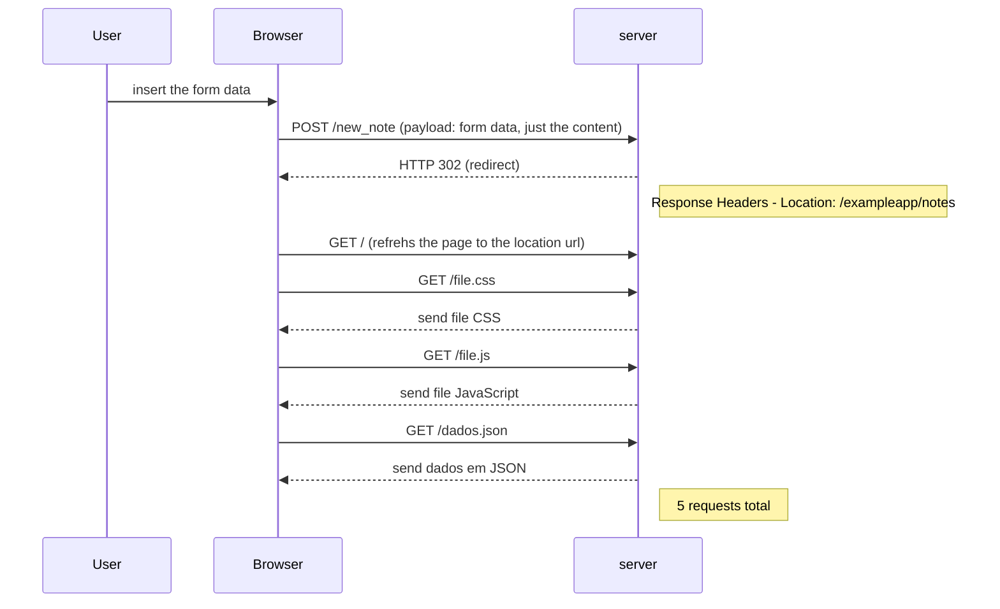

```mermaid
sequenceDiagram
    participant User
    participant Browser
    participant server

    User->>Browser: insert the form data
    Browser->>server: POST /new_note (payload: form data, just the content)
    server-->>Browser: HTTP 302 (redirect)
    Note right of server: Response Headers - Location: /exampleapp/notes

    Browser->>server: GET / (refrehs the page to the location url)
    Browser->>server: GET /file.css
    server-->>Browser: send file CSS

    Browser->>server: GET /file.js
    server-->>Browser: send file JavaScript

    Browser->>server: GET /dados.json
    server-->>Browser: send dados em JSON

Note right of server: 5 requests total

```
