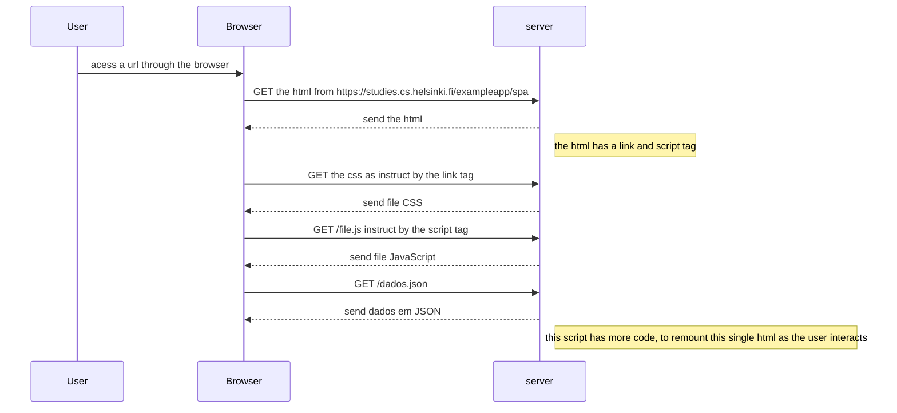

```mermaid
sequenceDiagram
    participant User
    participant Browser
    participant server

    User->>Browser: acess a url through the browser
    Browser->>server: GET the html from https://studies.cs.helsinki.fi/exampleapp/spa
    server-->>Browser: send the html
    Note right of server: the html has a link and script tag 

    Browser->>server: GET the css as instruct by the link tag
    server-->>Browser: send file CSS

    Browser->>server: GET /file.js instruct by the script  tag
    server-->>Browser: send file JavaScript

    Browser->>server: GET /dados.json
    server-->>Browser: send dados em JSON

Note right of server: this script has more code, to remount this single html as the user interacts 
```
