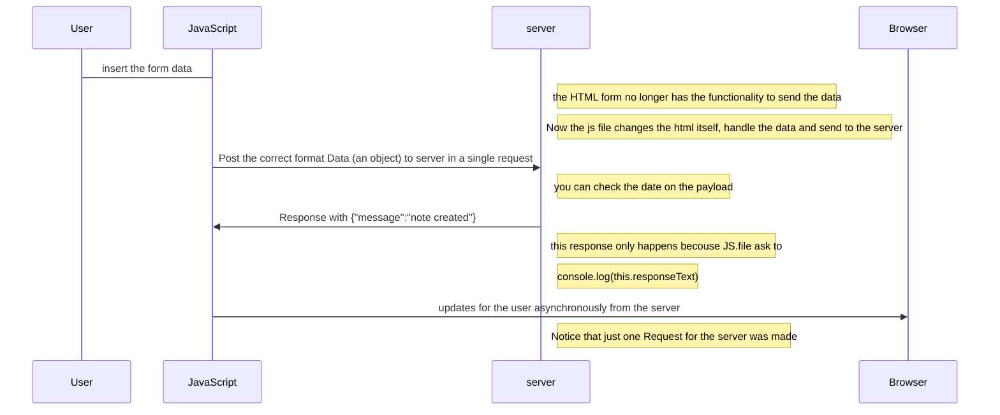

```mermaid
sequenceDiagram
    participant User
    participant JavaScript
    participant server
    participant Browser

    User->JavaScript: insert the form data
    Note right of server: the HTML form no longer has the functionality to send the data
    Note right of server: Now the js file changes the html itself, handle the data and send to the server

    JavaScript->>server: Post the correct format Data (an object) to server in a single request
    Note right of server: you can check the date on the payload
    server->>JavaScript: Response with {"message":"note created"}
    Note right of server: this response only happens becouse JS.file ask to
    Note right of server: console.log(this.responseText)

    JavaScript->>Browser: updates for the user asynchronously from the server
    Note right of server: Notice that just one Request for the server was made

```

